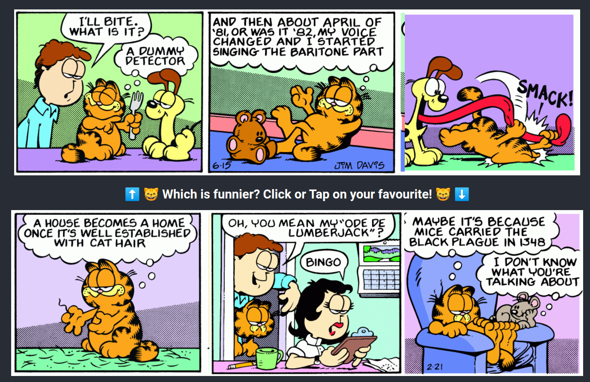

# Search For The Best Garfield Comic

An incredibly noble pursuit we took up in early 2019 to find the best garfield comic possible

## How do I help?
Hop on our website at https://searchforthebestgarfieldcomic.web.app/ and try it out for yourself! Every click brings us closer to our goal.



## How does it work?
Work might be a strong word. In essence, we split every garfield comic panel, and then recombine the panels randomly to create 2 strips.
The user is given an oppurtunity to select the funnier strip, which makes each panel more likely to be placed into a strip in that position later!

Given enough time this strategy will eventually converge to the best possible strip (given some very generous assumptions about comedy :P)


## Installation

The /functions directory contains google cloud functions to be uploaded, while the remainder is a react app that can be run using
```bash
npm install
npm start
```